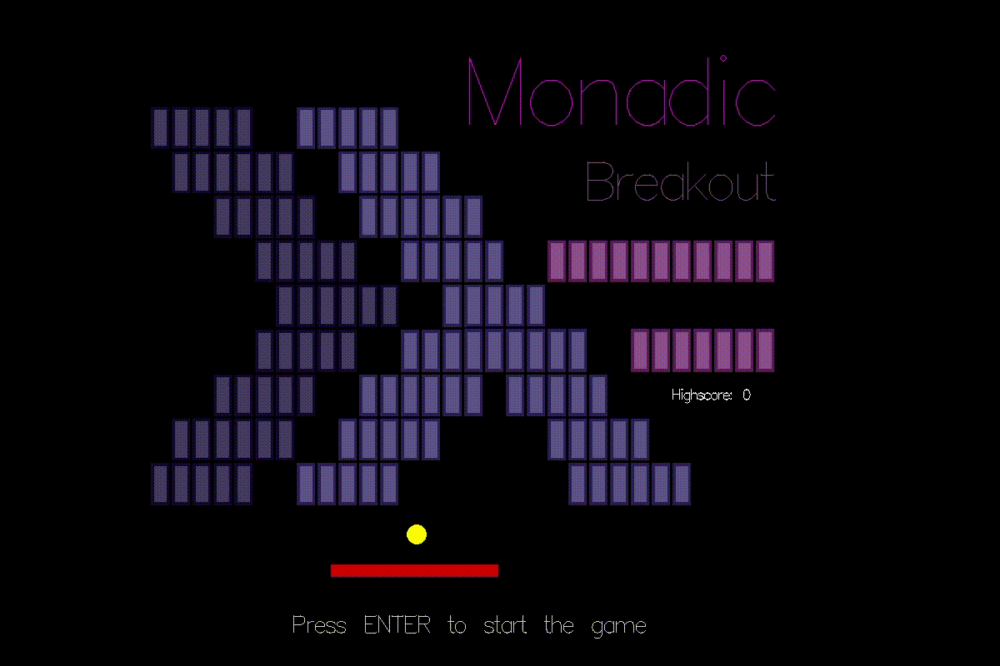

<h1 align="center">Monadic Breakout</h1>


<div align="center">

</div>

<p align="center">A remake of the classic Atari game Breakout in Haskell, gloss.</p>

## Overview

### Controls
- Cursor left/right - update the Paddle’s horizontal position
- R - skip the current level
- Enter, Space - Start a game / respawns a ball after loosing all

### Gameplay
Break all bricks for each level before you loose all 3 lives or the timer runs out. Bricks
may have a durability where it takes multiple ball collisions to break it. Some bricks earn you more
points than others. 

There are bonus bricks, coloured white, which apply a bonus affect when broken:
- **IndestructiBall** - Your ball becomes immune to brick collisions and is 2 times larger than usual.
- **MultiBall** - Spawns 3, faster, green balls at the paddle position to help breaking bricks.
- **Large Paddle** - Your paddle becomes 1.5x wider.


## Usage

The following installation requires `docker`, but it can be built natively.

<details>
<summary>Installation without Docker / native (not tested)</summary>

Prerequisites:
- `cabal`
- OpenGL libraries (GLFW)

Run the program `cabal install && cabal run monadic-breakout`

</details>

### Docker
- Build the image

    ```./build.sh```

- Run the game

    Uses the host's X server to open windows from the container - mounting `~/.Xauthority` is necessary.

    ```./run.sh```

- Cleanup

    Delete the haskell and breakout Docker images.

    ```docker image prune```

---

## Architectural Choices
Used gloss’s `playIO` function to interact with the IO monad during game updates: when a game ends,
update the highscore text file when we beat our previous best.

### Data Structures for Storing Bricks

#### Inefficient Brick array
I initially developed the game to store bricks in a list of type `[Brick]` where each Brick stored its length,
width and on screen coordinates. I could filter collided Bricks by checking whether the Ball intersected
with its boundaries. Running this check for all bricks each frame was expensive - An `O(n)` operation. 


#### Brick coordinate map
I replaced it with a Haskell's map implementation, to index screen bricks by their game row and column - of type `Map (Int, Int) Brick`.
I could access a brick by transforming screen coordinates to (column, row) pairs. Haskell's `Map` used a balanced binary tree under the hood so this was
an `O(log n)` operation - an improvement.

#### Ball collisions
To find the bricks a ball has collided with, I convert the screen coordinates
at the top, bottom, left and right-most points on the Ball’s circumference to brick (column, row)
pairs. Accessing the map returns all bricks touching the ball.

### Levels

Loaded from text files, easy to add new levels.

## Gameplay Design Decisions
- Levels are loaded via text file which use a basic format. This makes it straight forward add new levels.
- Controlling the paddle position is done with mouse movements instead of keyboard for better control.
- I separated the `tickWorld` function from `updateWorld` to make clear that all functions updating the game `World` are *pure* and done outside the `IO` monad.


## Libraries used
- **Gloss** - rendering all game elements
- **containers** - For the `Map` data structure to store and access Bricks


<details>
<summary><h2>Experience Writing the Program</h2></summary>

- When creating my tickWorld function, it required creating several other `updateXYZ` functions
to for updating bricks, balls, score and state. This function also relied heavily on where syntax
to ”store” common variables.

- Storing Brick collisions in the x and y axis as (Maybe Brick, Maybe Brick) allowed the ball’s
velocity components to be reflected whenever the corresponding position in the collision tuple
was `Just Brick{..}`.

- Updating Bricks in the Map and searching the Map for collided bricks was difficult as the data
structure is immutable and I needed to seperate Map updates from lookups. I used foldr to
update the Map for each Ball on screen, accumulating the updated Map. With multiple Balls
implemented, I added the bonus MultiBall.

</details>

## Resources Used
- [Hake](https://github.com/dixonary/hake/) - guidance on designing my `World` and `State` data types for different stages of the game
- [Making a Glossy Game!](https://mmhaskell.com/blog/2019/3/25/making-a-glossy-game-part-1) - understanding basic structure of a gloss program
